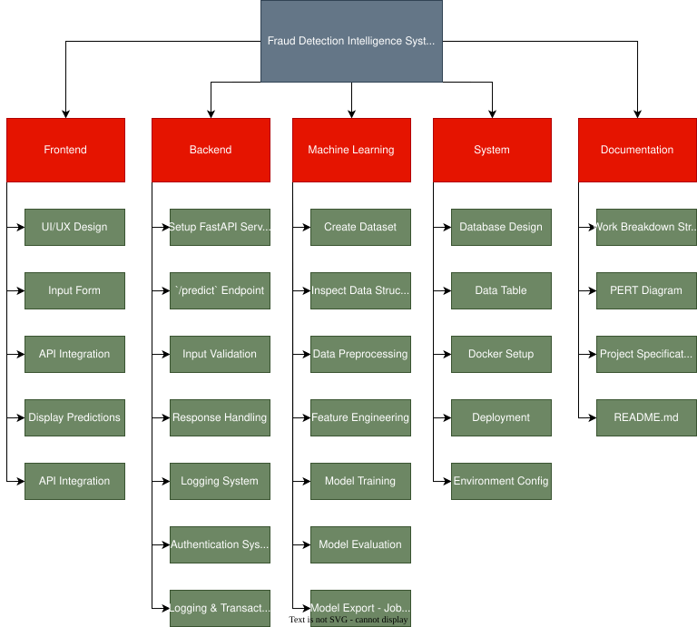
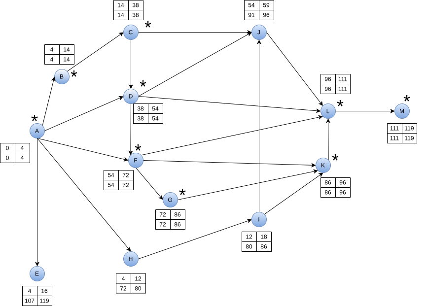

# Fraud-detection-intelligence-system

Website for analyzing and validating bank payments through the use of Machine Learning.

This project demonstrates how machine learning can be used to improve financial security by detecting potentially fraudulent activities.

---

## Features

- Input of transaction data through the user interface
- Trained machine learning model which predicts probability of fraud
- Immediate display of the fraud probability results to the user
- Backend API for handling requests between the frontend and the machine learning model

---

## How to Run

1. Clone the repository:

``` bash
git clone https://github.com/Dominik-Bedekovic/fraud-detection-intelligence-system.git
```

2. Install dependencies:

```bash
pip install -r requirements.txt

```

3. Run the backend:

```bash
python -m uvicorn backend.app.main:app --reload
```

4. Paste the URL into a browser's search bar:

```
http://127.0.0.1:8000
```

5. Database:

The project uses PostgreSQL for storing users, transactions, and prediction results.

For local development, start the database with:

```
docker compose up -d
```

---

## Project structure

- `backend/` – API and server logic  
- `frontend/` – user interface   
- `ml/` – machine learning model  
- `docs/` – documentation  

---

## Tech Stack

- Frontend: HTML, CSS, JavaScript
- Backend: Python (FastAPI)
- Machine Learning: Scikit-learn (pipeline-based ML system)
- Data processing: Pandas, NumPy
- Model storage: Joblib
- Version Control: Git + GitHub

---

## Project Planning

### Work Breakdown Structure


### PERT Diagram


### PERT Table

<details>

| ID | Task                              | Effort (person-hours) | Preconditions |
|----|-----------------------------------|------------------------|---------------|
| A  | Project Setup                     | 4                      | -             |
| B  | Dataset & Data Documentation      | 10                     | A             |
| C  | Machine Learning Baseline         | 24                     | B             |
| D  | Backend v1                        | 16                     | A, C          |
| E  | Documentation                     | 12                     | A             |
| F  | Frontend                          | 18                     | A, D          |
| G  | Dashboard & Flagging              | 14                     | F             |
| H  | Database Design                   | 8                      | A             |
| I  | User and Transaction Tables       | 6                      | H             |
| J  | Store Prediction Results          | 5                      | C, D, I       |
| K  | User Registration and Login       | 10                     | I, F          |
| L  | Integration and Finalization      | 15                     | D, F, G, J, K |
| M  | Deployment / Docker               | 8                      | L             |
</details>

---

## Authors
- Dominik Bedeković
- Matija Dežjot
- Ella Vučemilović-Grgić
- Perun Vinski
